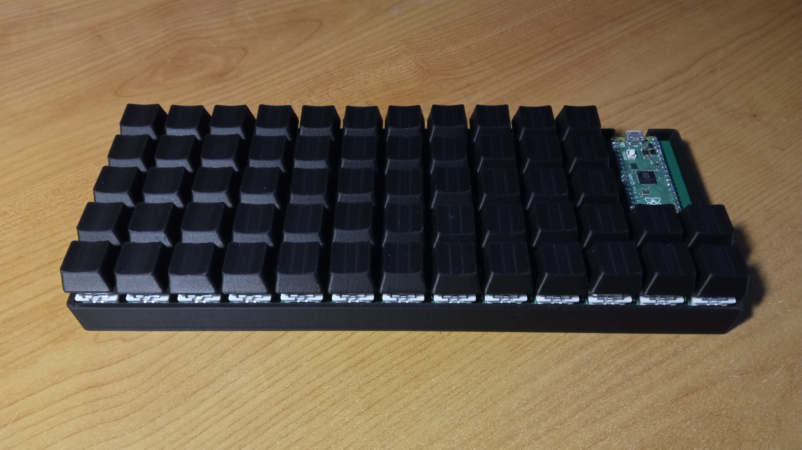
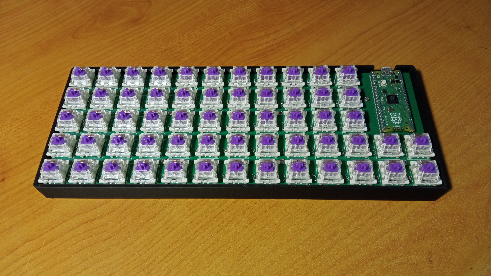

# Crude-59
A 59-key USB keyboard built using Raspberry Pi Pico

## Images

## Bill of materials
| Name                   | Details                        | Quantity |
|------------------------|--------------------------------|----------|
| 3D printing filament   | PLA was used                   | A/R      |
| Solder                 |                                | A/R      |
| PCB                    | 1.2mm thickness                | 1        |
| Raspberry Pi Pico      |                                | 1        |
| USB-A to Micro-B cable |                                | 1        |
| M2 screw               | Pan head, 6mm long             | 8        |
| M2 brass insert        | 6mm long, 3.5mm outer diameter | 8        |
| Cherry MX switch       |                                | 59       |
| 1N4148 diode           |                                | 59       |
